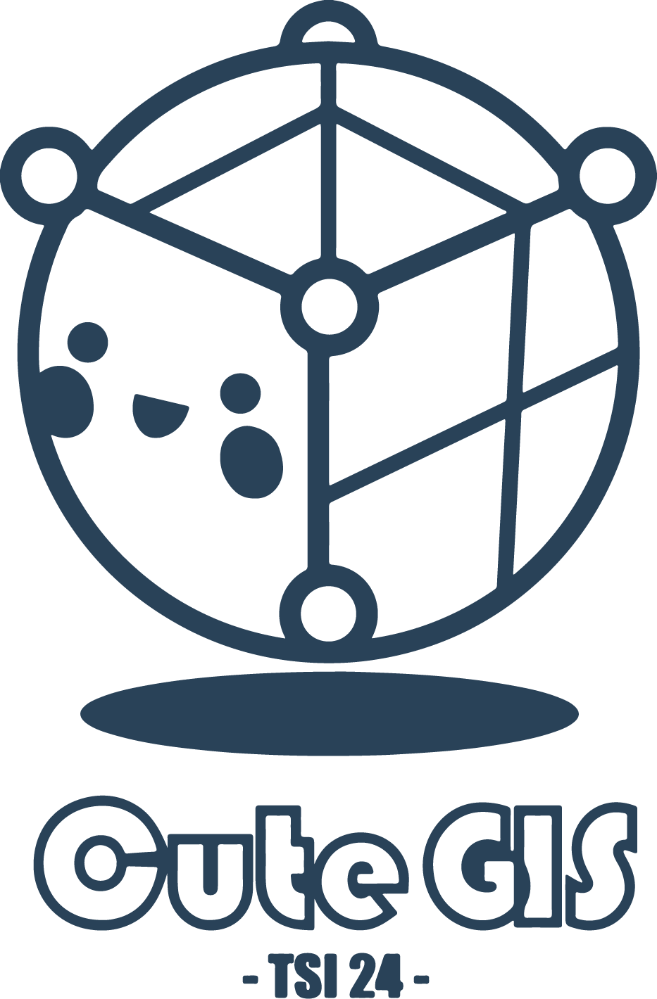

<p align="center">
    
</p>

<p align="center">
    
</p>

# GIS application project


Cute-gis is a full-featured, user-friendly, free-and-open-source (FOSS) geographical information system (GIS) that runs on Unix platforms.

## Table of contents
* [Features](#features)
* [Installing](#installing-cute-gis)
* [Utilisation](#utilisation)

## Features

- This mini-GIS can load and display 2D and 3D data from a variety of files including .shp, .geojson and more.
- You will be able to move around a map and explore data from the GrandLyon.
- It is also possible to perform some spatial analysis such as intersections or buffers.

## Installing Cute-gis

- Clone or download source-code from this repository
```bash
    gh repo clone ENSG-TSI24/cute-gis
```
- Move to the good place
```bash
    cd path/to/cute-gis
```
- Instantiate a docker container by running this line:

```bash
    docker build -t cute-gis .
```
- Finally you can now, run the container:
```bash
    docker build --detach cute-gis
```

## Utilisation

__to be completed__