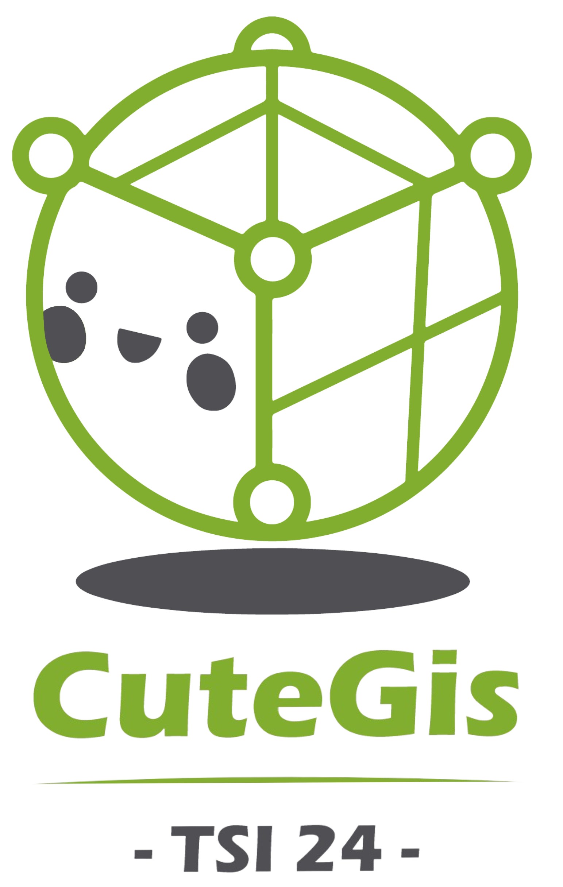

<p align="center">
    
</p>

# 🗺️ Mini-Gis project 🗺️


Cute-gis is a full-featured, user-friendly, free-and-open-source (FOSS) geographical information system (GIS) that runs on Unix platforms.

## Table of contents
* [Features](#features)
* [Installing](#installing-cutegis)
* [Utilisation](#how-to-use-cutegis)
* [Dependencies](#dependencies)

## Features

### 2D Mode

In 2D mode, CuteGis offers a variety of features to manage and visualize geospatial data:

- Local Data Loading: Supports loading of local data files in formats such as .shp, .geojson, and .tiff.
- Data Streaming: Load data via WMS (Web Map Service) and WFS (Web Feature Service) streams.
- Visualization: Visualize image layers (e.g., orthophotos) and vector layers (e.g., roads, buildings, etc.).
- Camera Control: Simple camera controls including zoom and pan to navigate the map.
- Layer Management: A robust layer management system allowing you to reorder, rename, delete layers, and focus on specific layers.
- Entity Information Display: View entity information in an attribute table and highlight individual elements through mouse interaction.
- Session Management: Save and restore previously loaded layers with the session system, retaining the last state of the application.

### 3D Mode

Unfortunately, CuteGis does not currently support a full 3D mode with all the feature available in 2d mode. In the existing 3D mode, you can:

-  Load .obj files
-  Display them in the view area, and navigate through the view.

## Installing CuteGis

- Clone or download source-code from this repository
```bash
    gh repo clone ENSG-TSI24/cute-gis
```
- Move to the good place
```bash
    cd path/to/cute-gis
```
- Enable Display Access: To render the main window of the application from the docker container, run the following command:

```bash
    xhost +
```
- Finally you can now, build and run the container:
```bash
    docker-compose up
```

## Dependencies

### Compilation and Development Tools
- `build-essential` : essential compilation tools for C/C++ development.
- `cmake` : build system and project file generation tool.

### Qt6 and Related Tools
- `qt6-tools-dev` : development tools for Qt6.
- `qt6-tools-dev-tools` : additional tools for Qt6 development.
- `qt6-base-dev` : base libraries for Qt6.
- `qt6-base-dev-tools` : tools associated with Qt6 base libraries.
- `qt6-declarative-dev` : development tools for Qt6 declarative modules.
- `qt6-multimedia-dev` : development tools for Qt6 multimedia modules.

### Graphics and OpenGL Dependencies
- `libgl1-mesa-dev` : development libraries for Mesa OpenGL.
- `libglew-dev` : development libraries for GLEW (OpenGL Extension Wrangler).
- `libglfw3-dev` : development libraries for GLFW (OpenGL, window, and event management).
- `libglu1-mesa-dev` : development libraries for Mesa GLU (OpenGL Utility Library).
- `libgl-dev` : development libraries for OpenGL.
- `libxrandr-dev` : libraries for screen size management under X11.
- `libxi-dev` : libraries for input event management under X11.
- `libxinerama-dev` : libraries for multi-monitor support under X11.
- `libx11-dev` : libraries for interaction with the X11 server.
- `libglm-dev` : mathematics library for OpenGL (GLM).

### Geospatial and JSON Libraries
- `gdal-bin` : command-line tools for geospatial data manipulation.
- `libgdal-dev` : development libraries for GDAL (Geospatial Data Abstraction Library).
- `nlohmann-json3-dev` : library for handling JSON in C++.

### Static Code Analysis Tools
- `cppcheck` : static analysis tool for C/C++ code.

### Testing Framework
- `libgtest-dev` : development libraries for Google Test (GTest) testing framework.


## How to use CuteGis

### Load Data Files

You can load data files into the application. Here are some examples:

- **Supported File Formats:**
    - **For 2D:** `.shp`, `.geojson`, `.tiff`.
    - **For 3D:** `.obj`.

- **Steps in 2D Mode:**
    1. Click on the **"File"** button and then **"Open File"** in the user interface.
    2. Two options are available:
        - **Local Data:** Import a file from your file system.
        - **Flux Data:**
            1. Choose the web service URL (only WMS/WFS).
            2. Select the layer to load.
    3. Confirm to display the data on the map.

- **Steps in 3D Mode:**
    1. Click on the **"File"** button and then **"Open File"** in the user interface.
    2. Import a local file in `.obj` format.
    3. Confirm to display the 3D model.

### Navigation and Exploration

- **Interact with the Map:**
    - Use the mouse or touchpad to:
        - **Zoom :** Scroll the mouse wheel(2D) or use the Z and S keys(3D).
        - **Pan:** Click and drag to move the map.
    - You can also use the arrow keys or `ZQSD` to navigate.

- **Explore the Data:**
    - Right-click on layers in the **Layer manager** to display their options.

***For further details, please refer to the user guide available in the docs directory!***

